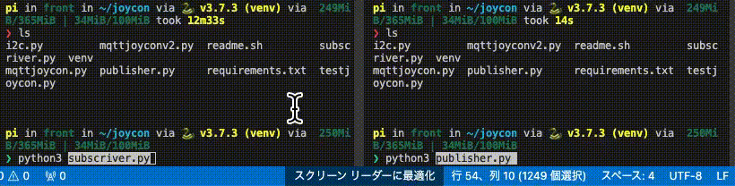

# MQTT を用いたPublisherからSubscriverへデータを送るプログラム

## 概要:
CloudMQTTを用いたPublisherからSubscriverへデータを送るプログラム

- Publisher.py からメッセージをBrokerへtopic宛にSend
- Subscriver.py でtopicを建てBrokerからtopic宛のメッセージを受信

本プログラムにおいて、TLS/SSL 通信におけるCAはRPIのを使用しています.    
適宜パスを置き換えてください.

[How do I connect using TLS/SSL? ↗︎](https://www.cloudmqtt.com/docs/faq.html)


## 関係図:

- 役職
    - 担当機体
    - ->概要
- Publisher
    - RPI(Publisher.py) or Websocket UI(CloudMQTT console内に存在)でも代用可能
    - ->データを(Brokerへ)送信 
- Broker
    - CloudMQTT 
    - ->別のクライアント(Publisher)からの要求(topic)に従ってデータを(Subscriverへ)送信
- Subscriver
    - RPI(Subscriver.py)
    - ->Brokerからデータを受け取る

## 処理の流れ

    None

## 使用の仕方

```bash:
# python venv環境(仮想化)と仮想化環境にモジュールのインストール
python3 -m venv venv && \
source ./venv/bin/activate && \
python3 -m pip install --upgrade pip && \
pip install -r requirements.txt

# プログラム実行
python3 gpioled.py

# 終了時
deactivate

# 2回目以降のvenv環境の再有効化
source ./venv/bin/activate
python3 gpioled.py
```

## 実行時

1. プログラム実行時、client.subscribe("SubscriberNAME")で設定した"SubscriberNAME"でメッセージを受信するために待機状態になります.

2. CloudMQTT Console内のWebsoketUIから <1.> で設定した"SubscriberNAME"宛にメッセージをSend

3. PublisherであるWebsoketUIから送信されたメッセージはBroker(CloudMQTT)を介して,
Subscriber宛にSendされます. 

4. Subscriber宛にSendされたメッセージはbyteで送られてくるため,UTF-8でデコードしメッセージの内容に応じて条件分岐などで処理をしてあげます.



ここまでが本プログラムの一連の流れです.