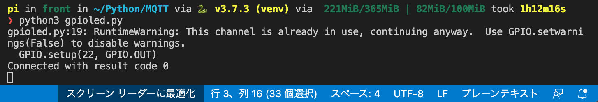
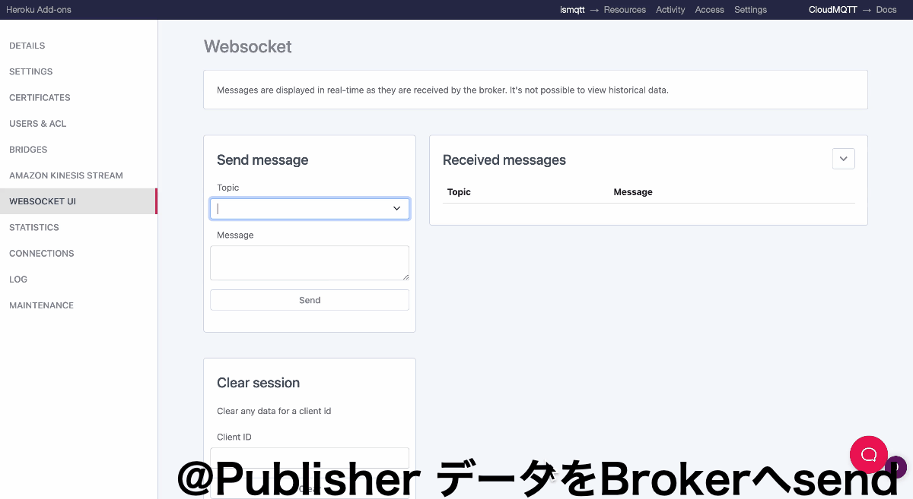
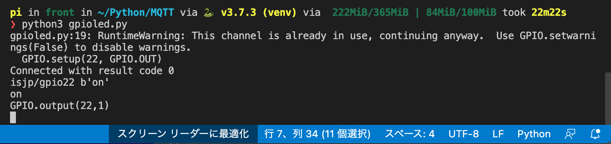

# MQTT を用いた遠隔地からのLED制御

## 概要:
CloudMQTTを使用した遠隔操作のテストプログラム
Publisher からのデータに応じてLED(GPIO22Pin)をON/OFFします.
本プログラムにおいて、RPIはSubscriverの役割を果たします

## 関係図:

- 役職
    - 担当機体
    - ->概要
- Publisher
    - RPI or Websocket UI(CloudMQTT console内に存在)
    - ->データを(Brokerへ)送信 
- Broker
    - CloudMQTT 
    - ->別のクライアント(Publisher)からの要求に従ってデータを(Subscriverへ)送信
- Subscriver
    - RPI
    - ->Brokerからデータを受け取る

## 処理の流れ


```python:
# ライブラリー
import paho.mqtt.client as mqtt
import RPi.GPIO as GPIO
import time


def on_connect(client, userdata, flags, rc):
    """ 
    コネクション設立時の処理
    "SubscriberNAME"を設定することで,
    その名前のSubscriberとして待機する.
    client.subscribe("SubscriberNAME")
    """
    print("Connected with result code "+str(rc))
    client.subscribe("isjp/gpio22")
 
def on_message(client, userdata, msg):
    """
    Brokerから受け取ったデータはbyteになっている.
    そのため符号化させたい場合は".decode('utf-8')"を用いる
    また, msg.payload にデータが格納されているため,
    内容によって処理を分岐させることが可能
    """
     print(msg.topic+" "+str(msg.payload))
     print(msg.payload.decode('utf-8'))
     if msg.payload.decode('utf-8') == "on":
         GPIO.output(22,1)
         print("GPIO.output(22,1)")
     else:
         GPIO.output(22,0)

# GPIOの初期設定
GPIO.setmode(GPIO.BCM)
GPIO.setup(22, GPIO.OUT)

client = mqtt.Client()
client.on_connect = on_connect
client.on_message = on_message
 
client.tls_set("/etc/ssl/certs/ca-certificates.crt")
client.username_pw_set("USERNAME", "PASSWD")
client.connect("SERVER", SSLPORT)
 
client.loop_forever()

```

## 使用の仕方

```bash:
# python venv環境(仮想化)と仮想化環境にモジュールのインストール
python3 -m venv venv && \
source ./venv/bin/activate && \
python3 -m pip install --upgrade pip && \
pip install -r requirements.txt

# プログラム実行
python3 gpioled.py

# 終了時
deactivate

# 2回目以降のvenv環境の再有効化
source ./venv/bin/activate
python3 gpioled.py
```

## 実行時

1. プログラム実行時、client.subscribe("SubscriberNAME")で設定した"SubscriberNAME"でメッセージを受信するために待機状態になります.



2. CloudMQTT Console内のWebsoketUIから <1.> で設定した"SubscriberNAME"宛にメッセージをSend



3. PublisherであるWebsoketUIから送信されたメッセージはBroker(CloudMQTT)を介して,
Subscriber宛にSendされます. 


4. Subscriber宛にSendされたメッセージはbyteで送られてくるため,UTF-8でデコードしメッセージの内容に応じて条件分岐などで処理をしてあげます.

```python:
def on_message(client, userdata, msg):
    """
    Brokerから受け取ったデータはbyteになっている.
    そのため符号化させたい場合は".decode('utf-8')"を用いる
    また, msg.payload にデータが格納されているため,
    内容によって処理を分岐させることが可能
    """
     print(msg.topic+" "+str(msg.payload))
     print(msg.payload.decode('utf-8'))
     if msg.payload.decode('utf-8') == "on":
         GPIO.output(22,1)
         print("GPIO.output(22,1)")
     else:
         GPIO.output(22,0)

```


ここまでが本プログラムの一連の流れです.