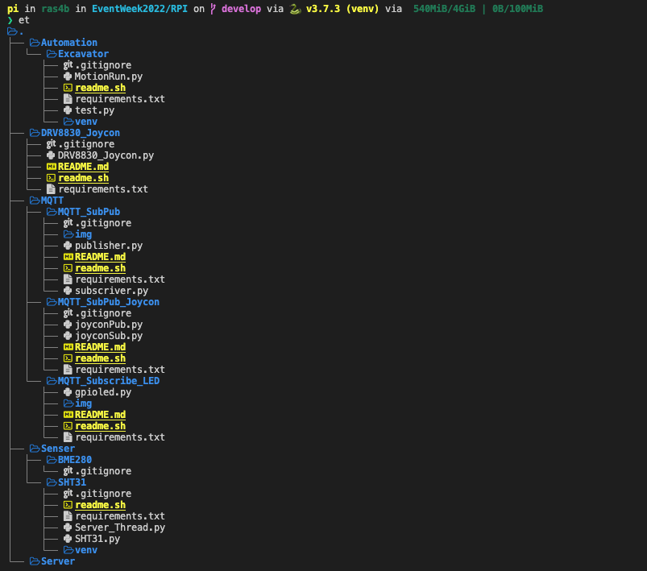

# RPIディレクトリについて

このディレクトリにはRaspberryPiシリーズで動作しているプログラムが格納されています。   
構成は以下の通りです。

- ディレクトリ名
    - 概要
    - README.MD LINK
- Automation/Excavator
    - 自動掘削機(ショベル)の制御プログラム
    - [Open ↗︎](./Automation/Excavator/)
- DRV8830_Joycon
    - Bluetooth制御のプログラム
    - [README.MD ↗︎](./DRV8830_Joycon/README.md)
- MQTT/MQTT_SubPub
    - MQTTを用いた遠隔制御(テスト)プログラム
    - [README.MD ↗︎](./MQTT/MQTT_SubPub/README.md)
- MQTT/MQTT_SubPub_Joycon
    - MQTTとJoyconを用いた遠隔制御(送受信)プログラム
    - [README.MD ↗︎](./MQTT/MQTT_SubPub_Joycon/README.md)
- MQTT/MQTT_Subscribe_LED
    - MQTTを用いた遠隔制御(テスト)プログラム
    - [README.MD ↗︎](./MQTT/MQTT_Subscribe_LED/README.md)
- Senser/BME280
    - 温湿度,気圧,測定プログラム
    - [Open ↗︎](./Senser/BME280/)
- Senser/SHT31
    - 温湿度,測定プログラム
    - [Open ↗︎](./Senser/SHT31/)

